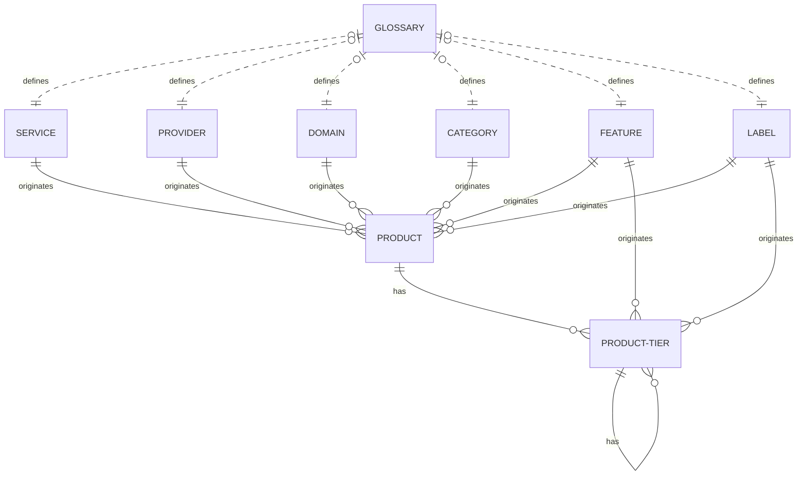
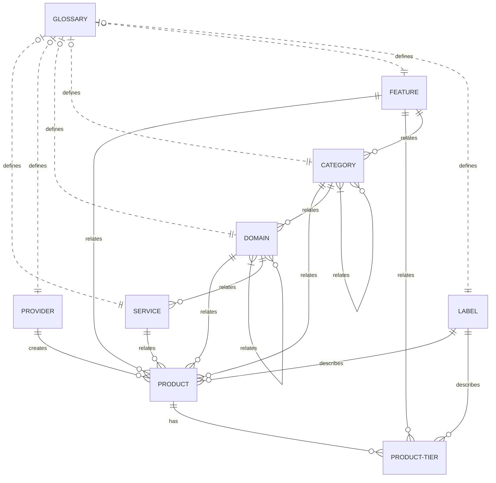
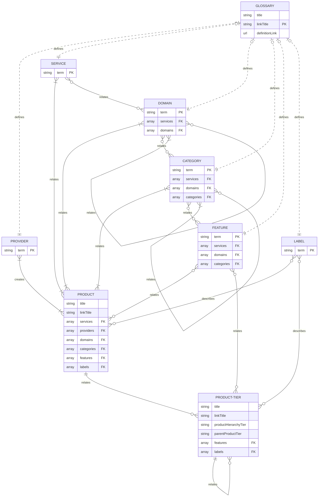
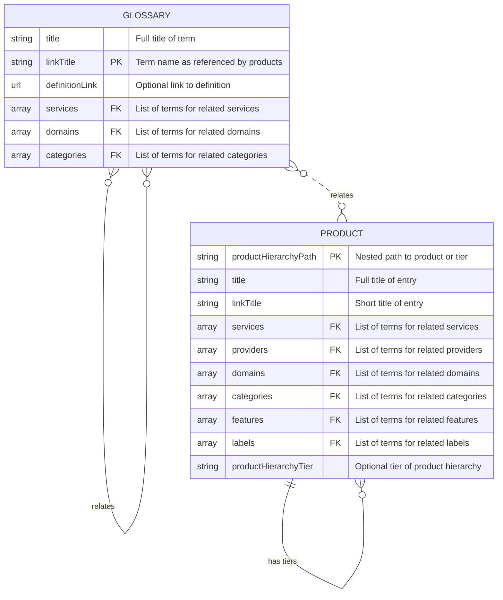

Lexical.cloud curates cloud products into hierarchical groups, also known as a taxonomy.
Taxonomy terms are populated by metadata in each product, product tier and glossary entry.

| Entry Type | Description | [Directory in product catalog](https://github.com/lexical-cloud/lexical-cloud-docs/en/) |
| ---------- | ----------- | ------- |
| Product | Documented cloud products | products/{service}/{provider}/ | 
| Product Tier | Tiers of cloud products | products/{service}/{provider}/{product}/{tier}/{tierProduct} | 
| Glossary | Terms in product taxonomy | glossary/ |


Use "Create docs issue" to submit ideas for improving the below illustrations. Thanks!


## Taxonomy Group

Terms for each group originate in products. The glossary independently defines a term.

| Group | Description | Example Terms |
| ------ | ---------- | ------- |
| Service | Purpose of a cloud product | Monitor, Governance  |
| Provider | Originator of a cloud product | AWS, Azure, Google Cloud |
| Domain | Collection of services with intersecting categories | Observability, Modernization |
| Category | Group specific to a domain and/or service | Auditing, Dashboards |
| Feature | Specific functionality from a product | Alerts, Reports |
| Label | Attribute of a product | Deprecated |

## Example Metadata

Let's explore **product** entries for monitoring products:













And **glossary** entries that support them:
















Notice the relationship of glossary `linkTitle` with the product entries.

##### What about **product tier** entries?

The products above did not have any product tiers, but examples would be:



---
features:
  - "example feature"
labels:
  - "example label"
title: "Product Name (model name)"
linkTitle: "Model Name"
productHierarchyTier: "model"
---


---
features:
  - "example feature"
labels:
  - "example label"
title: "Product Component Name"
linkTitle: "Component Name"
productHierarchyTier: "component"
---



Notice that services, categories and domains were not listed. They're inherited from the product. It's possible to list additional entries for all groups, but that is not illustrated on this page.

**Products vs Product Tiers**

| Difference | Product | Product Tier |
| ---------- | ------- | ------------- |
| Location | `{product-path}/product-id.md` | `{product-path}/product-id/tier-id/tier-product-id.md` |
| Attribute | N/A | `productHierarchyTier="model" or "component"` | 
| Groups | can inherit from glossary | also inherits from product |   

**Models vs Components**

| Difference | Model | Component |
| ---------- | ------- | ------------- |
| Purpose | Types of a product | Sub-products |
| Nesting | Under product or component | Under product |

## Term Relations

The glossary optionally relates each term to ancestor groups. Many products reference each term.

| Group | Ancestors | Descendants |
| ------ | ---------- | ------- |
| Service | N/A | Domain, Category, Feature |
| Provider | N/A | N/A |
| Domain | Domain | Service, Category, Feature |
| Category | Domain, Service, Category  | Feature |
| Feature | Domain, Service, Category  | N/A |
| Label | N/A  | N/A |

Domain and Category can have subgroups. i.e. `container orchestrator` and `kubernetes`

## Logical Data Model

Terms referenced in product entries inhert their ancestors from the glossary.

The model flexibility incurs some complexity and potential of duplicate relationships.

## Physical Data Model

Each product specifes minimal taxonomy terms and infers relationships from the glossary.

Each product and tier entry should minimally list or inherit a service, domain and category. The `productHierarchyPath` is not an actual column but the physical path in the directory tree.
