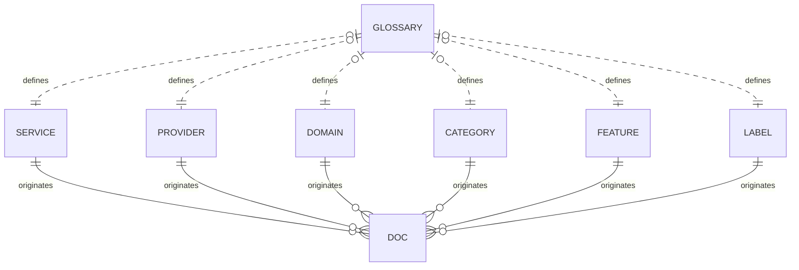
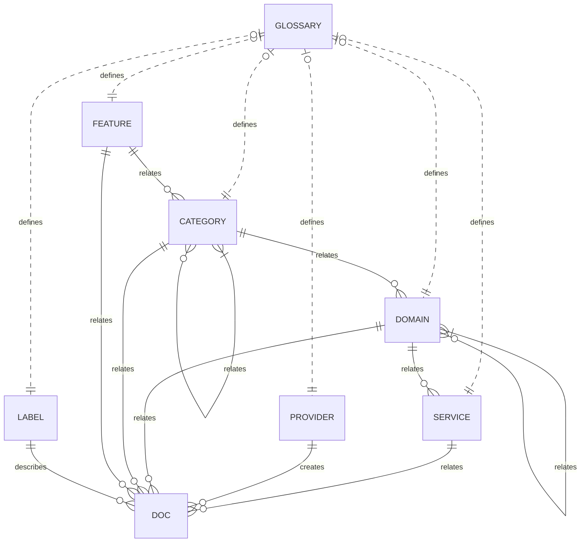
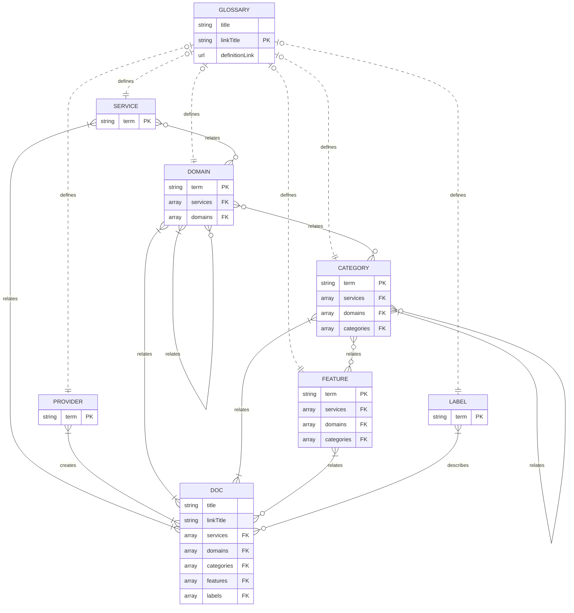
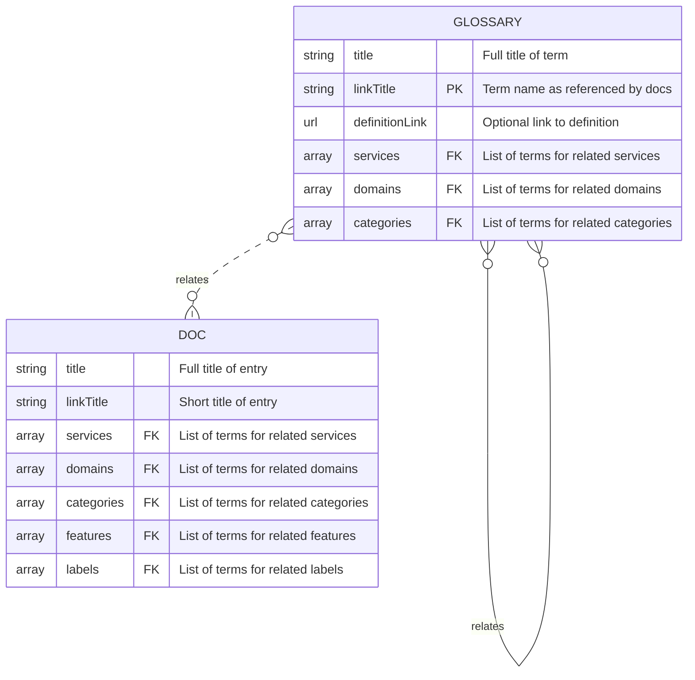

The docs of Lexical.cloud curate cloud products into hierarchical categories known as a taxonomy.
Taxonomy terms are populated by metadata from each doc and glossary entry.


Use "Create docs issue" to submit ideas for improving the below illustrations. Thanks!


## Taxonomy Entities

Terms for each entity originate in the docs. The glossary independently defines a term.

| Entity | Description | Example Terms |
| ------ | ---------- | ------- |
| Service | Purpose of a cloud product | Monitor, Governance  |
| Provider | Originator of a cloud product | AWS, Azure, Google Cloud |
| Domain | Collection of services with intersecting categories | Observability, Systems management |
| Category | Group specific to a domain and/or service | Cost management, Dashboards |
| Feature | Specific functionality from a product | Alerts, Reports |
| Label | Attribute of a product | Deprecated |

## Example Metadata

Let's explore **doc** entries for monitoring products:













And **glossary** entries that support them:
















## Term Relations

The glossary optionally relates each term to ancestor entities. Many docs reference each term.

| Entity | Ancestors | Descendants |
| ------ | ---------- | ------- |
| Service | N/A | Domain, Category, Feature |
| Provider | N/A | N/A |
| Domain | Domain | Service, Category, Feature |
| Category | Domain, Service, Category  | Feature |
| Feature | Domain, Service, Category  | N/A |
| Label | N/A  | N/A |

## Logical Data Model

The nested structure of the data is not great for illustrating in ER diagrams.

## Physical Data Model

Each doc specifes minimal taxonomy terms and infers relationships from the glossary.

