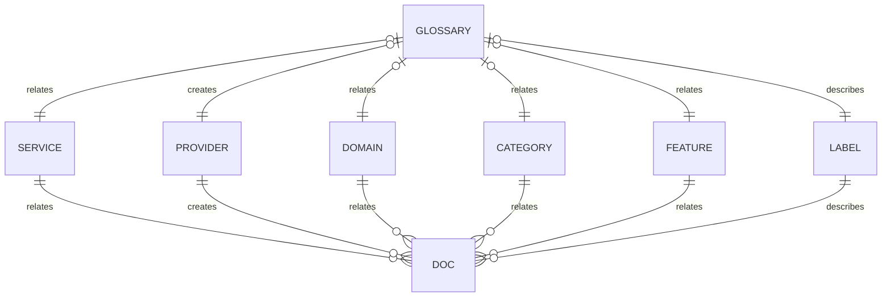
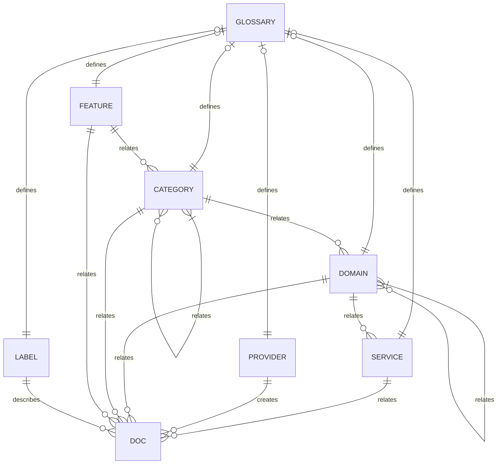
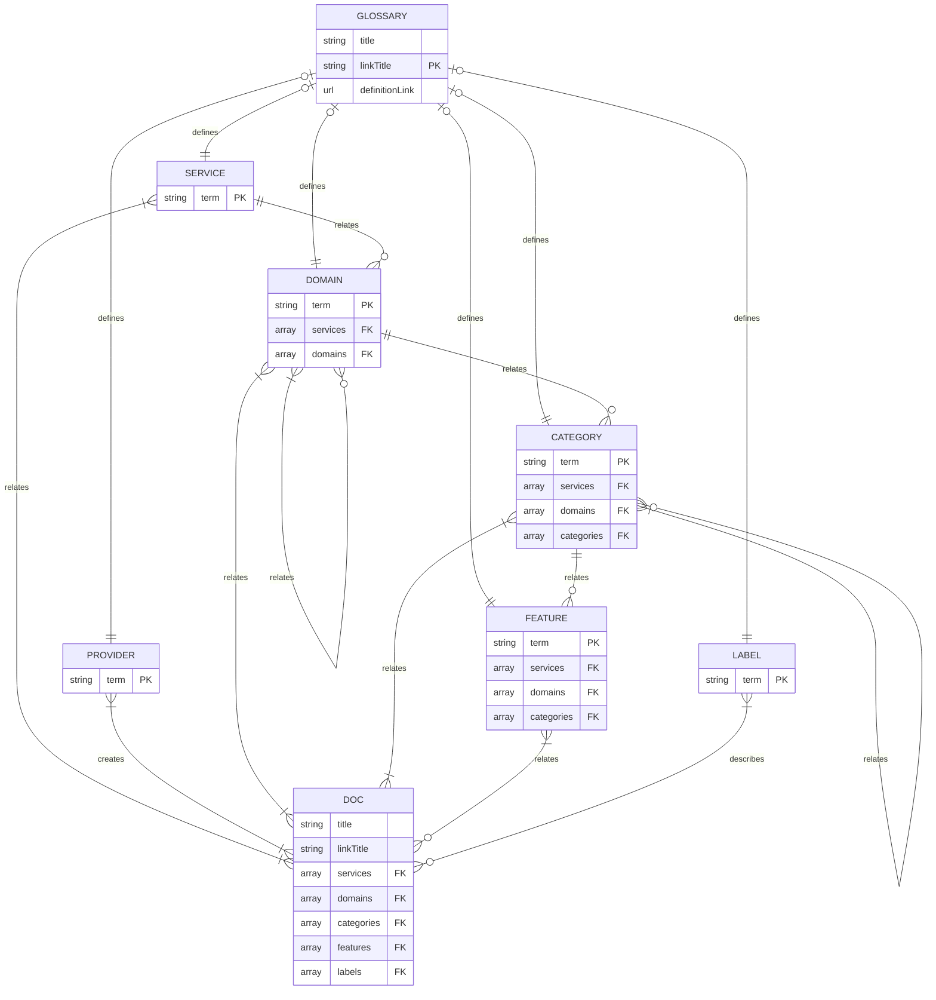
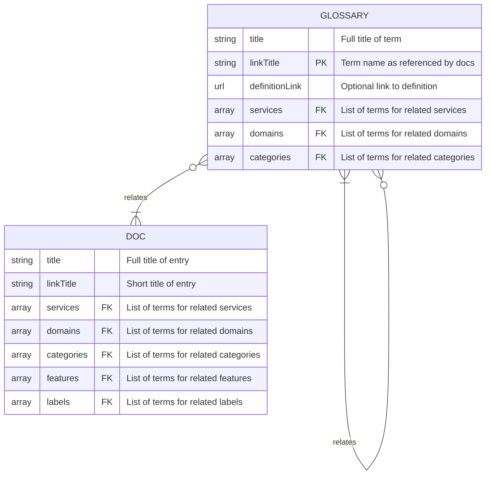

## Taxonomy Entities

```mermaid
erDiagram
    GLOSSARY |o--|| SERVICE : relates
    GLOSSARY |o--|| PROVIDER : creates
    GLOSSARY |o--|| DOMAIN : relates
    GLOSSARY |o--|| CATEGORY : relates
    GLOSSARY |o--|| FEATURE : relates
    GLOSSARY |o--|| LABEL : describes
    SERVICE ||--o{ DOC : relates
    PROVIDER ||--o{ DOC : creates
    DOMAIN ||--o{ DOC : relates
    CATEGORY ||--o{ DOC : relates
    FEATURE ||--o{ DOC : relates
    LABEL ||--o{ DOC : describes
```

## Taxonomy Relations

```mermaid
erDiagram
    GLOSSARY |o--|| SERVICE : defines
    GLOSSARY |o--|| PROVIDER : defines
    GLOSSARY |o--|| DOMAIN : defines
    GLOSSARY |o--|| CATEGORY : defines
    GLOSSARY |o--|| FEATURE : defines
    GLOSSARY |o--|| LABEL : defines
    SERVICE ||--o{ DOC : relates
    PROVIDER ||--o{ DOC : creates
    DOMAIN ||--o{ DOC : relates
    CATEGORY ||--o{ DOC : relates
    FEATURE ||--o{ DOC : relates
    LABEL ||--o{ DOC : describes
    DOMAIN }|--o{ DOMAIN : relates
    DOMAIN ||--o{ SERVICE : relates
    CATEGORY ||--o{ DOMAIN : relates
    CATEGORY }|--o{ CATEGORY: relates
    FEATURE ||--o{ CATEGORY : relates
```

## Logical Model

```mermaid
erDiagram
    GLOSSARY |o--|| PROVIDER : defines
    GLOSSARY |o--|| SERVICE : defines
    GLOSSARY |o--|| DOMAIN : defines
    GLOSSARY |o--|| CATEGORY : defines
    GLOSSARY |o--|| FEATURE : defines
    GLOSSARY |o--|| LABEL : defines
    GLOSSARY {
        string title
        string linkTitle PK
        url definitionLink
    }
    SERVICE }|--|{ DOC : relates
    SERVICE ||--o{ DOMAIN : relates
    SERVICE {
        string term PK
    }
    PROVIDER }|--|{ DOC : creates
    PROVIDER {
        string term PK
    }
    DOMAIN }|--|{ DOC : relates
    DOMAIN ||--o{ CATEGORY : relates
    DOMAIN }|--o{ DOMAIN : relates
    DOMAIN {
        string term PK
        array services FK
        array domains FK
    }
    CATEGORY }|--|{ DOC : relates 
    CATEGORY ||--o{ FEATURE : relates
    CATEGORY }|--o{ CATEGORY: relates
    CATEGORY {
        string term PK
        array services FK
        array domains FK
        array categories FK
    }
    FEATURE }|--o{ DOC : relates 
    FEATURE {
        string term PK
        array services FK
        array domains FK
        array categories FK
    }
    LABEL }|--o{ DOC : describes
    LABEL {
        string term PK
    }
    DOC {
        string title
        string linkTitle
        array services FK
        array domains FK
        array categories FK
        array features FK
        array labels FK
    }
```

## Physical Model

```mermaid
erDiagram
    GLOSSARY }|--o{ GLOSSARY : relates
    GLOSSARY {
        string title "Full title of term"
        string linkTitle PK "Term name as referenced by docs"
        url definitionLink "Optional link to definition"
        array services FK "List of terms for related services"
        array domains FK "List of terms for related domains"
        array categories FK "List of terms for related categories"
    }
    GLOSSARY }o--|{ DOC : relates
    DOC {
        string title "Full title of entry"
        string linkTitle "Short title of entry"
        array services FK "List of terms for related services"
        array domains FK "List of terms for related domains"
        array categories FK "List of terms for related categories"
        array features FK "List of terms for related features"
        array labels FK "List of terms for related labels"
    }
```
