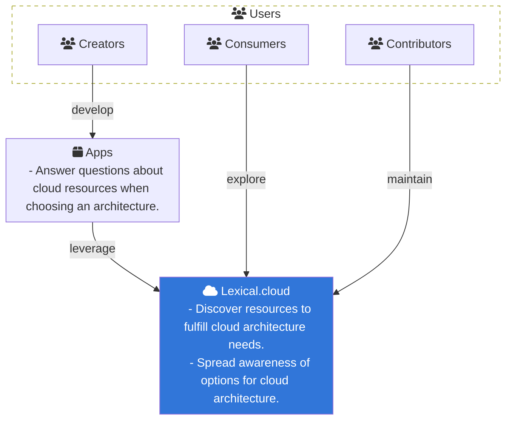
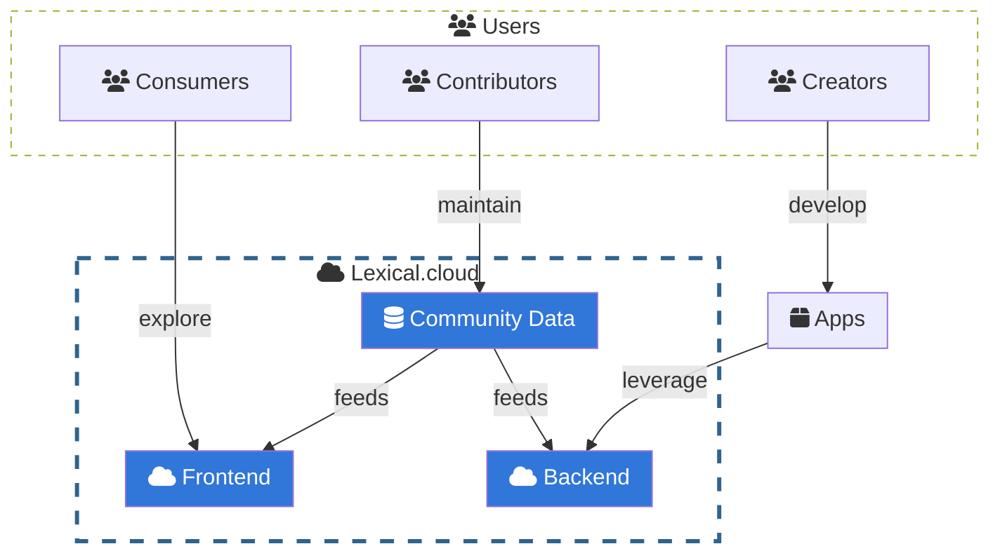
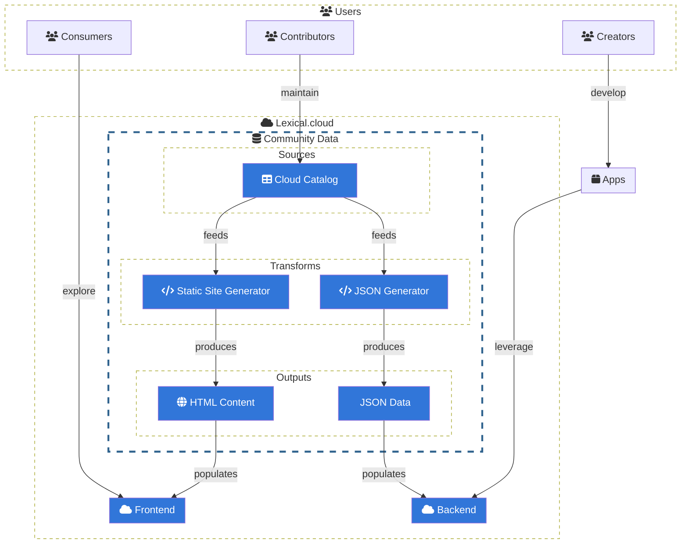
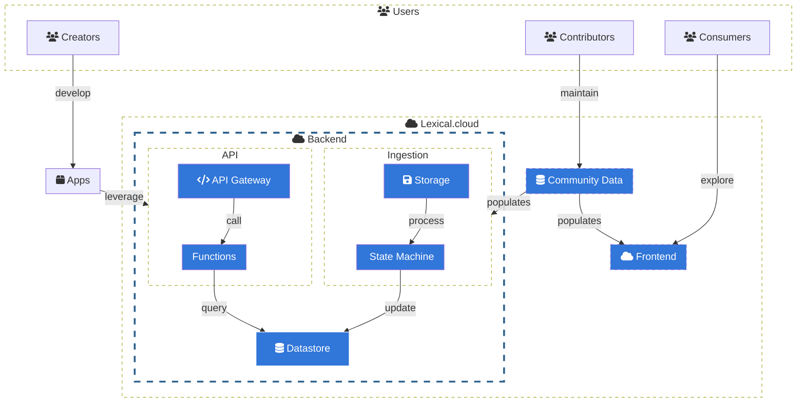
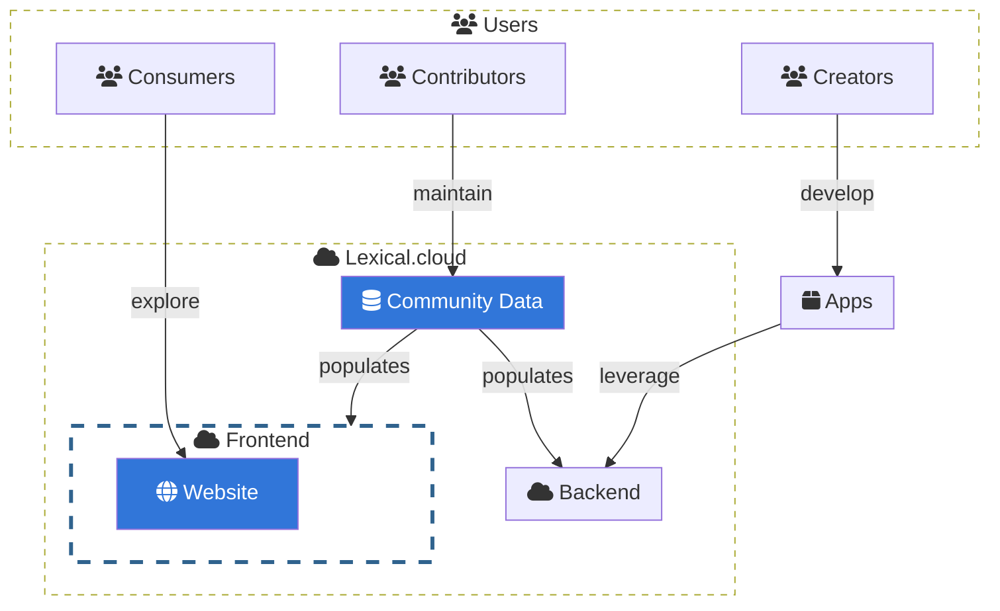
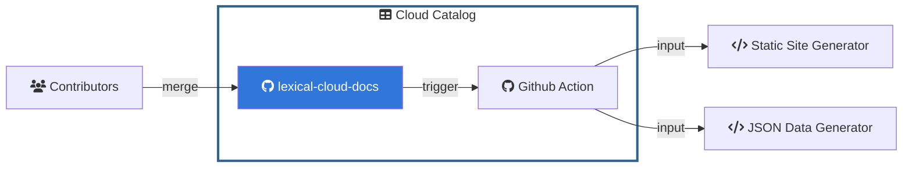
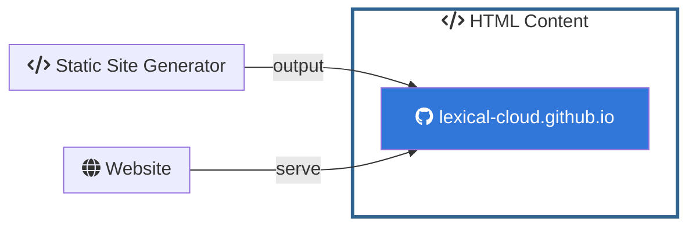
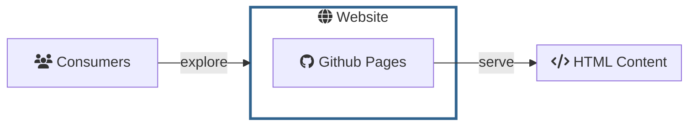
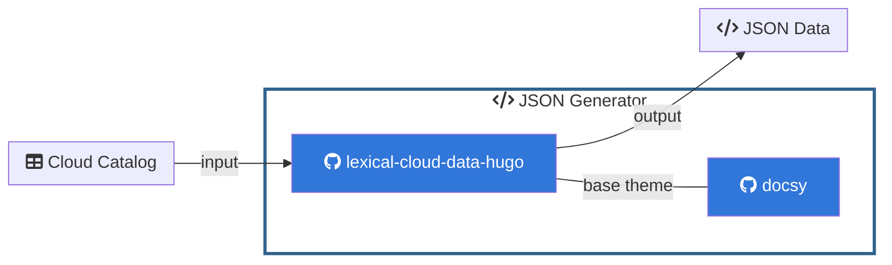
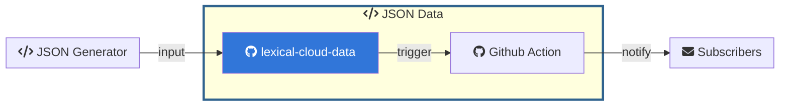

Cloud computing is a vast domain with offerings from many providers. Challenges presented by many providers include:

  * Vernacular differs with each cloud provider
  * Product naming creates distinct vocabularies for each provider
  * Features are distributed differently across products
  * Translation between clouds providers is an art

Lexical.cloud is a cross-reference of products and capabilities from many cloud providers. Goals of this project include:

  * Grouping products for discoverability
  * Identifying capabilities of each product
  * Linking product features with a shared vocabulary

Keep reading below to understand the big picture. The explanation is organized into the following sections:
  * [Context](#context) explains the who and why
  * [Containers](#containers) explains the what
  * [Components](#components) explains the how

## Context

As a `creator`, I want to _develop_ `apps` that _leverage_ the `Lexical.cloud` catalog,
so I can answer questions about cloud resources when choosing an architecture.

As a `consumer`, I want to _explore_ the `Lexical.cloud` catalog,
so I can discover what resources exist to fulfill cloud architecture needs.

As a `contributor`, I want to _maintain_ the `Lexical.cloud` catalog,
so I can spread awareness of options for cloud architecture.

### Lexical.cloud

Given `Lexical.cloud` is a `community data` project \
when `contributors` _maintain_ the `community data` \
then `community data` _feeds_ the `frontend` and `backend`.

Given `Lexical.cloud` exposes data in a `backend` \
when `community data` _feeds_ into the `backend` \
then `apps` can _leverage_ the `backend`.

Given `Lexical.cloud` needs a `frontend` to display data \
when `community data` _feeds_ into the `frontend` \
then `consumers` can _explore_ the `frontend`.

## Containers

### Community Data

Given `Lexical.cloud` `community data` `sources` \
include a `cloud catalog` \
when `contributors` _maintain_ the `cloud catalog` \
then the `cloud catalog` _feeds_ many `transforms`.

Given `Lexical.cloud` `community data` `tranforms` \
include a `static site generator` \
when the `static site generator` _produces_ `html content` \
then the `html content` _populates_ the `frontend` \
and `consumers` can _explore_ that content on the `website`.

Given `Lexical.cloud` `community data` `tranforms` \
include a `json generator` \
when the `json generator` _produces_ the `json data` \
then the `json data` _populates_ updates to the `backend` \
and `apps` _leverage_ services on the `backend`.

### Backend

Given `Lexical.cloud` `backend` begins `ingestion` with `storage` \
when `community data`_populates_ backend `storage` \
then data in `storage` is ready to _process_ by the `state machine`.

Given `Lexical.cloud` `backend` persist state in a `datastore` \
when `ingestion` completes at the `state machine` \
then the `state machine` will _update_ the `datastore`.

Given `Lexical.cloud` `backend` `api` is fronted by an `api gateway` \
when `apps` _leverage_ the `api` \
then the `api gateway` will _call_ `functions` \
and the `functions` will _query_ the `datastore`.

### Frontend

Given `Lexical.cloud` `frontend` includes a `website` \
when `community data` _populates_ the `frontend` \
then `consumers` can _explore_ that content on the `website`.

## Components

### Cloud Catalog

Given the `cloud catalog` consist of the repository at [`lexical-cloud-docs`](https://www.github.com/lexical-cloud/lexical-cloud-docs) \
and `lexical-cloud-docs` has a `GitHub Action` that triggers on merge completion \
when `contributors` _merge_ content into `lexical-cloud-docs` \
then a `Github Action` sends the catalog as _input_ to `static site generator` \
and a `Github Action` sends the catalog as _input_ to `json generator generator`.

_TODO: Github Action_

### Static Site Generator

Given the `static site generator` consist of the repository at [`lexical-cloud-docs-hugo`](https://www.github.com/lexical-cloud/lexical-cloud-docs-hugo) \
and `lexical-cloud-docs-hugo` has a _base theme_ of [`docsy`](https://www.github.com/lexical-cloud/docsy) for [hugo](https://gohugo.io/) \
when the `cloud catalog` is _input_ to `lexical-cloud-docs-hugo` \
then `lexical-cloud-docs-hugo` sends _output_  to `html content`. 

### HTML Content

Given the `html content` consist of the repository at [`lexical-cloud.github.io`](https://www.github.com/lexical-cloud/lexical-cloud.github.io) \
when the `static site generator` sends _output_ to `lexical-cloud.github.io` \
then the `website` will _serve_ content at `lexical-cloud.github.io`.

### Website

Given the `website` is hosted on `Github Pages` \
when `consumers` _explore_ the `website` \
then `Github Pages` _serve_ the repository of `HTML content`

### JSON Generator

Given `json generator` consist of the repository at [`lexical-cloud-data-hugo`](https://www.github.com/lexical-cloud/lexical-cloud-data-hugo) \
and `lexical-cloud-data-hugo` has a `base theme` of [`docsy`](https://www.github.com/lexical-cloud/docsy) for [hugo](https://gohugo.io/) \
when `lexical-cloud-docs` is _input_ to `lexical-cloud-data-hugo` \
then `lexical-cloud-data-hugo` sends _output_ to `lexical-cloud-data`.

### JSON Data

Given the `json data` consist of the repository at [`lexical-cloud-data`](https://www.github.com/lexical-cloud/lexical-cloud-data) \
and `lexical-cloud-data` has a `Github Action` that executes on merge completion \
when the `json generator` sends _output_ to `lexical-cloud-data` \
then the `Github action` fires an event to _notify_ `subscribers`.

_TODO: Github Action_

### API Gateway  

_TODO_

### Functions

_TODO_

### Storage

_TODO_

### State Machine

_TODO_

### Datastore

_TODO_
